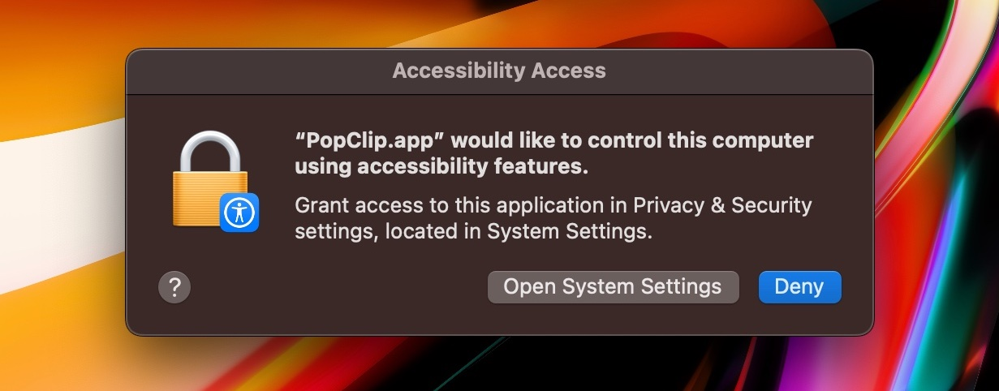
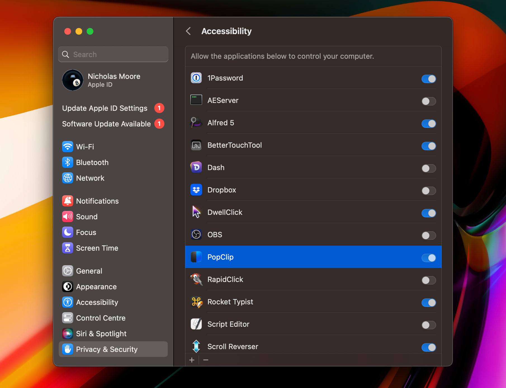
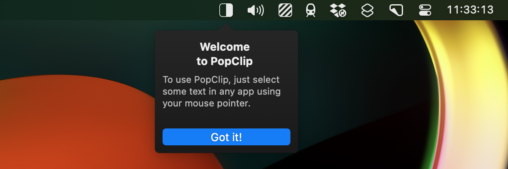

# Getting Started

This page will guide you through the process of obtaining and installing PopClip on your Mac.

## Obtaining PopClip

There are 3 ways to obtain PopClip:

* **Direct download (free trial, unlockable with license key)**: Download PopClip from the [Downloads]() page on this website. The download is a zip file containing the PopClip app. Unzip the file and drag the PopClip app to your Applications folder. 

* **Mac App Store**: PopClip is available to buy on the Mac App Store as a one-time purchase. [View PopClip on Mac App Store]().

* **Setapp**: [Setapp]() is a subscription service for Mac apps, offering access to hundreds of Mac apps for $9.99 per month. If you're a Setapp customer, PopClip is included in your subscription. Simply search for "PopClip" in the Setapp interface and click Install.

### Editions

I refer to the above three variants of PopClip as **editions**. They are the *Standalone edition* (the direct download), the *Mac App Store edition* and the *Setapp edition* of PopClip. The editions all share the same features and abilities, and the only significant difference is the way you obtain the app and how you buy it. There are some minor technical differences, which I will point out in this guide where relevant.

<!-- ::: warning
You should only have one edition of PopClip installed on your Mac at a time. If you have multiple copies of the PopClip app installed, you may experience unexpected behaviour.
::: -->

### Requirements

The latest version of PopClip requires macOS 10.13 (High Sierra) or later. It is compatible with both Intel and Apple Silicon Macs.

::: tip
Older versions of PopClip are available for older operating systems. See the Downloads page.
:::

### Free trial

When you first install the Standalone edition of PopClip, it operates in free trial mode. The free trial mode includes all features, but after you have used 150 PopClip actions it will nag you to buy the app. You can [buy a license key]() to unlock the app and remove the nagging. The Mac App Store and Setapp editions do not have a free trial mode.

#### Registering the license key

Your license key will be delivered to you as file whose name ends with `.popcliplicense`. Save the license key file to your Mac and double click it. PopClip will automatically open the file and register itself with the license key.

## First launch

By now, you should have a copy of the PopClip app in the Applications folder (or in the Setapp folder inside the Applications folder) on your Mac. Double-click the PopClip app to launch it.

### Granting Accessibility permission

When you first launch PopClip, its icon (initially greyed out) will appear in the menu bar and a message will appear on screen: *To continue, PopClip needs to enable Accessibility access.*

#### Why is Accessibility permission needed?

PopClip uses a macOS feature called the Accessibility API to read the text you select in other apps. Since this is an essential part of PopClip's operation, you cannot use PopClip without enabling Accessibility access.

PopClip only uses the Accessibility API to read the text you select. All processing is done locally on your Mac and no information is stored or transmitted anywhere, except when you explicitly invoke an internet-connected action such as a web search. See also [Privacy policy]().

#### How to grant Accessibility permission

Click the Enable PopClip button and a macOS dialog appears:

Now click Open System Settings and you will be taken to the Security & Privacy pane of System Preferences. On macOS 13.0 and above it looks like this:

Toggle the slider for PopClip to on. You will be prompted to enter your password to confirm the change.

Finally, PopClip will show the Welcome to PopClip message:

Next, we will put PopClip though its paces!

## Uninstalling PopClip

Before we move on, let's take a moment to learn how to uninstall PopClip. First quit PopClip if it is running, then:

* To uninstall the Standalone edition or Mac App Store edition of PopClip, drag the PopClip app from your Applications folder to the Trash.

* To uninstall the Setapp edition, use the "Uninstall" option on the PopClip page in the Setapp app.

You can also delete the preferences file, application support folder and caches folder if you wish to remove all traces of PopClip from your Mac. See [File locations]().

