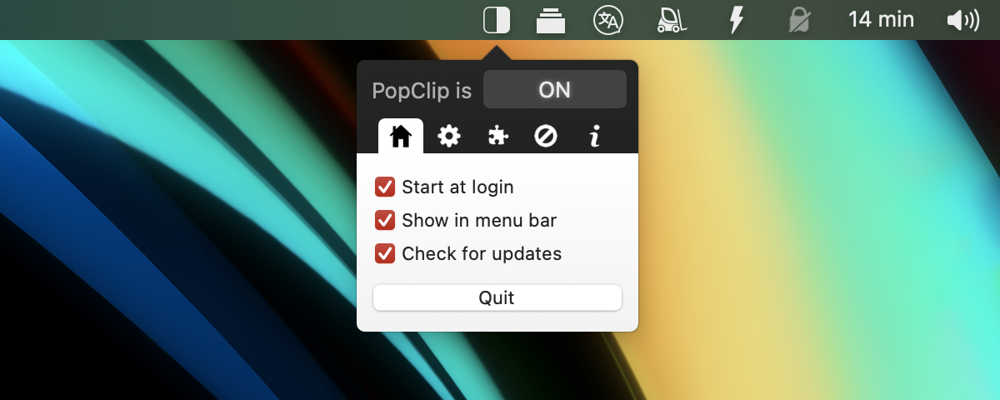

# Settings

This page will give you a comprehensive overview of PopClip's settings.

## The settings menu

PopClip's settings menu is accessed by clicking the  icon in the menu bar.

The settings menu has five panes: [ Home](#home-pane), [ Options](#options-pane), [ Actions](#actions-pane), [ Excluded Apps](#excluded-apps-pane) and [ About](#about-pane).

### Turn PopClip On and Off

The large button at the top showing **ON** and **OFF** controls whether PopClip appears automatically when you select text.

As a short-cut, you can also toggle PopClip on and off by secondary clicking (Right-click or Control-click) the PopClip icon in the menu bar.

On/off state can also be set with [AppleScript]().

:::tip Still works when off!
Even when PopClip is turned off, you can use the [keyboard shortcut](./basics#activate-with-a-keyboard-shortcut) to make PopClip appear.
:::

##  Home pane

<figure>
  
  
  <figcaption>Home pane: Standalone edition (left), Mac App Store and Setapp editions (right).</figcaption>
</figure>

### App settings

- **Start at login:** When enabled, PopClip will start automatically when you log in to your Mac.
- **Show in menu bar:** When disabled, the icon will be hidden from the menu bar. To show PopClip's settings when the icon is hidden, double-click the PopClip app in your Applications folder.
- **Check for updates** (Standalone edition only): When enabled, PopClip will check for updates automatically in the background. You can trigger an immediate update check by un-checking and re-checking this option.

:::tip Mac App Store and Setapp editions
If you have the Mac App Store or Setapp edition, you will not see the *Check for updates* option. Updates are managed by the Mac App Store or Setapp.
:::

### Quit PopClip

At the bottom of the Home pane is the **Quit** button. Click this button to quit PopClip.

##  Options pane

### Appearance settings

- **Size:** Choose the size of the PopClip bar, with 4 presets from smallest to largest.

- **Color:** Choose the color of the PopClip bar:
  - **Dark:** Dark appearance.
  - **Light:** Light appearance.
  - **Auto:** Automatically switch between dark and light appearance based on the system setting.
  - **Auto (Inverse):** Automatically switch between dark and light appearance based on the system setting, with the color opposite to the system.

### Keyboard Shortcut

Set a keyboard shortcut for making PopClip appear. See [Activate with a keyboard shortcut](./basics#activate-with-a-keyboard-shortcut) for details on using it.

- To set the keyboard shortcut, click the Record Shortcut button and then press the keys you want to use. The key combination must include at least one of the modifer keys ⌃, ⌥, and ⌘.

- To remove or change the keyboard shortcut, click the button and then press the new keys or click the 'X' button.

:::tip Choosing a keyboard shortcut
You can use any key combination you like, but it's good to pick somehting that's easy to remember and doesn't conflict with other common shortcuts. Personally, I use ⌃⌘P.
:::
